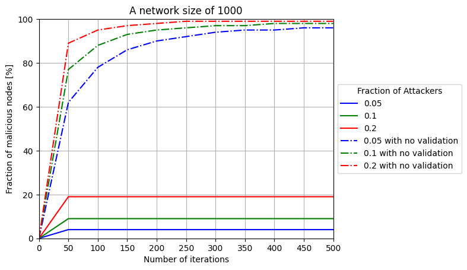

## Synopsis
An implementation and simulation experiment of GuardedGossip P2P protocol **GuardedGossip: Secure and Anonymous Node Discovery in Untrustworthy Networks** [doi](https://doi.org/10.1007/978-3-030-90019-9_7)

### Reproduced results


## Requirements
- Python 3.10
- Matplotlib library


## steps to replicate results
- run the following in your terminal
```bash
$ jupyter notebook sim.ipynb
```
- run the notebook cells to get the results


## configuration parameters
- `const.py` contains some of constant configuration of the protocol
- the jupyter notebook contains the following:
    - `NETWORK_SIZE`: controls the size of the network.
    - `MAX_ITER`: controls the maximum number of GuardedGossip iterations to be performed during the experiment.
    - `fracs`: Array contains the malicious peers percentages during the experiment.

